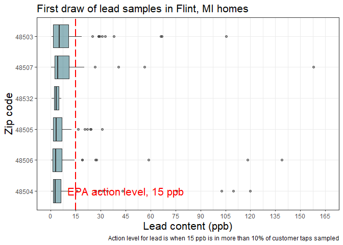

```r
flint 
```

```
## # A tibble: 271 x 6
##       id   zip  ward  draw1  draw2 draw3
##    <dbl> <dbl> <dbl>  <dbl>  <dbl> <dbl>
##  1     1 48504     6  0.344  0.226 0.145
##  2     2 48507     9  8.13  10.8   2.76 
##  3     4 48504     1  1.11   0.11  0.123
##  4     5 48507     8  8.01   7.45  3.38 
##  5     6 48505     3  1.95   0.048 0.035
##  6     7 48507     9  7.2    1.4   0.2  
##  7     8 48507     9 40.6    9.73  6.13 
##  8     9 48503     5  1.1    2.5   0.1  
##  9    12 48507     9 10.6    1.04  1.29 
## 10    13 48505     3  6.2    4.2   2.3  
## # ... with 261 more rows
```


```r
flint2 <- flint %>% 
  filter(zip != 48529, zip != 48502)

flint2$zip <- with(flint2, reorder(zip, draw1, median))
  
  
ggplot(flint2) + 
  geom_boxplot(aes(x = draw1, y = zip), fill = "#256d7b", alpha = 0.5) + 
  geom_vline(xintercept = 15, linetype = "longdash", color = "red", size = 1) + 
  labs(title ="First draw of lead samples in Flint, MI homes", 
       x = "Lead content (ppb)", 
       y = "Zip code", 
       caption = "Action level for lead is when 15 ppb is in more than 10% of customer taps sampled") + 
  scale_x_continuous(
    limits = c(0,165),
    breaks = seq(0, 165, 15)
  ) +
  annotate("text", x = 45, y = "48504", label = "EPA action level, 15 ppb", size = 16/.pt, color = "red") + 
  theme_bw() + 
  theme(plot.title = element_text(size = 16),
        axis.title.x = element_text(size = 16),
        axis.title.y = element_text(size = 16))
```

<!-- -->


